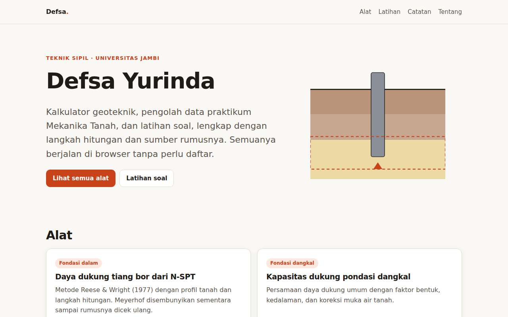

# Defsa Yurinda · Situs dan alat geoteknik

Kalkulator geoteknik, pengolah data praktikum Mekanika Tanah, dan latihan soal yang menampilkan langkah hitungan dan sumber rumusnya, terbit di **[defsayurinda.github.io](https://defsayurinda.github.io/)**.

[](https://github.com/defsayurinda/defsayurinda.github.io/actions/workflows/verifikasi.yml)
[](https://defsayurinda.github.io/)
[](LICENSE)
[](LICENSE-TULISAN)



## Alat

Tabel ini dibangun otomatis dari [`konten/alat.json`](konten/alat.json). Kolom status menunjukkan sumber rumus: asli (dicocokkan dengan sumber aslinya dan diuji dengan contoh soal buku), sekunder (dari sumber yang mengutip sumber asli), atau belum terverifikasi.

<!-- ALAT:MULAI -->
| Alat | Isi | Status sumber |
|---|---|---|
| [Kalkulator Tiang Bor N-SPT](https://defsayurinda.github.io/kalkulator/tiang-bor.html) | Hitung daya dukung aksial tiang bor dari data N-SPT dengan metode Reese & Wright (1977), lengkap dengan langkah hitungan dan asumsinya. | Sumber sekunder |
| [Kalkulator Pondasi Dangkal](https://defsayurinda.github.io/kalkulator/pondasi-dangkal.html) | Hitung kapasitas dukung pondasi dangkal dengan persamaan daya dukung umum: faktor bentuk, kedalaman, dan koreksi muka air tanah, lengkap dengan langkah hitungan. | Belum terverifikasi |
| [Kalkulator Penurunan Konsolidasi](https://defsayurinda.github.io/kalkulator/konsolidasi.html) | Hitung penurunan konsolidasi primer satu dimensi untuk lempung NC dan OC beserta lajunya terhadap waktu, lengkap dengan diagram e–log σ' dan langkah hitungan. | Belum terverifikasi |
| [Praktikum Mekanika Tanah](https://defsayurinda.github.io/praktikum/) | 16 alat pengolah data praktikum Mekanika Tanah: formulir seperti lembar data laboratorium, langkah hitungan, grafik, dan ekspor ke Word dan Excel. | Belum terverifikasi |
| [Latihan Soal Geoteknik](https://defsayurinda.github.io/latihan/) | Latihan soal geoteknik dengan angka acak dan pembahasan langkah demi langkah: pondasi dangkal, konsolidasi, dan tiang bor. | Belum terverifikasi |
<!-- ALAT:SELESAI -->

## Cara memakai

1. Buka alatnya di situs. Data contoh sudah terisi, jadi hasilnya langsung terlihat.
2. Ganti data dengan soal atau data praktikummu. Hasil dihitung ulang setiap angka berubah.
3. Baca bagian **Penyelesaian** untuk rumus, sumber, dan substitusinya, lalu **Catatan** untuk asumsinya.
4. Pakai **Salin tautan hasil** untuk berbagi data yang sama, atau **Cetak / simpan PDF**.

Semua alat berjalan di browser; data tidak dikirim ke server mana pun.

## Menambah isi

Catatan, soal, dan alat baru: lihat [PANDUAN.md](PANDUAN.md). Singkatnya:

```
pip install -r skrip/kebutuhan.txt
python3 skrip/buat.py catatan "Judul catatan"
python3 skrip/buat.py alat nama-alat --judul "Judul" --kategori fondasi --sumber "Penulis (tahun), judul, halaman"
python3 skrip/bangun_situs.py
for f in tests/verifikasi_*.py; do python3 "$f"; done
```

Struktur repo:

```
konten/     tulisan sumber (Markdown), registri alat (alat.json), daftar alat praktikum (praktikum.json)
docs/       situs yang diterbitkan GitHub Pages
  kalkulator/, latihan/, alat/     halaman alat (ditulis tangan)
  assets/*-hitung.js               rumus, dipisah dari tampilan supaya bisa diuji
  assets/praktikum/                kerangka, grafik, rumus, dan definisi alat praktikum
  tentang/, catatan/, praktikum/   halaman hasil bangun dari konten/ (jangan diedit langsung)
skrip/      bangun_situs.py: ubah konten/ jadi halaman; buat.py: kerangka alat atau catatan baru
tests/      verifikasi hitungan, bank soal, tautan, keamanan, dan registri
```

Aturan lengkap untuk Claude Code ada di [CLAUDE.md](CLAUDE.md).

## Cara mengutip

Tombol **Cite this repository** di halaman repo membaca [CITATION.cff](CITATION.cff). Contoh APA:

> Yurinda, D. (2026). *Kalkulator geoteknik* [Situs web]. https://defsayurinda.github.io/alat/

Untuk tugas atau laporan, kutip juga sumber rumus aslinya yang tercantum di setiap alat.

## Kontribusi

Laporan salah hitung dan usul alat sangat membantu; pakai templat Issue yang tersedia. Lihat [CONTRIBUTING.md](CONTRIBUTING.md), [Kode Etik](CODE_OF_CONDUCT.md), dan [SECURITY.md](SECURITY.md) untuk celah keamanan.

## Lisensi

- **Kode** (JavaScript, Python, CSS, kerangka HTML, workflow): [MIT](LICENSE).
- **Tulisan dan gambar** (isi `konten/`, teks halaman situs, tangkapan layar): [CC BY 4.0](LICENSE-TULISAN).

Keduanya boleh dipakai, disalin, dan diubah, termasuk untuk keperluan komersial, asal mencantumkan nama Defsa Yurinda dan tautan ke repo ini.
